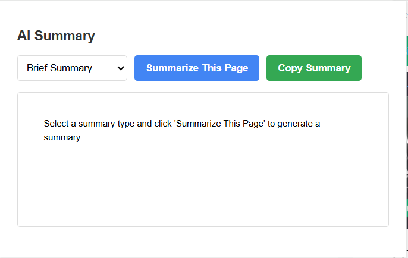
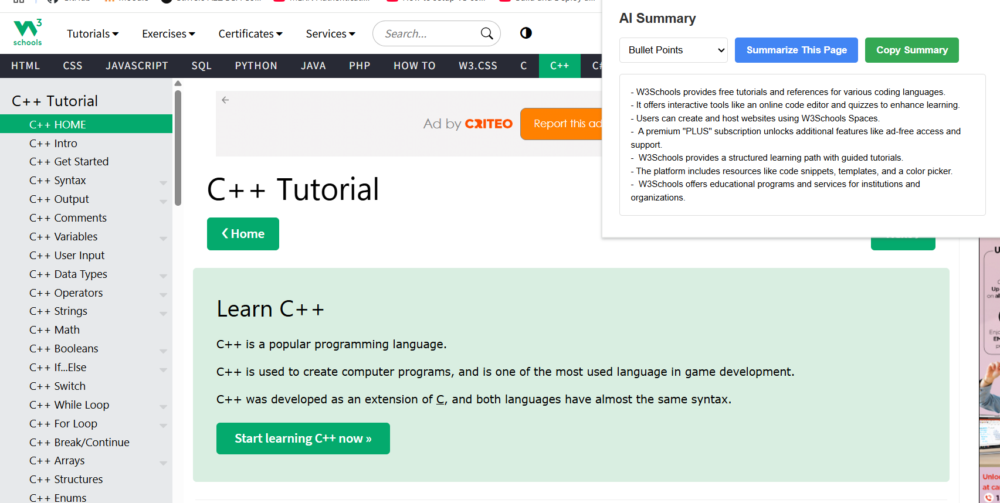

# AI Article Summarizer Extension 

This Chrome Extension uses the Gemini API to summarize any article or webpage in three modes: **brief**, **detailed**, or **bullet points** — right from your browser!

## ✨ Features

- One-click summary generation for any article or blog
- Supports multiple summary formats
- Allows copying of the summary
- Stores your Gemini API key securely using Chrome storage
- Clean, minimal UI

## ⚙️ How to Use

1. **Install the Extension Locally**  
   - Download or clone the repo
   - Go to `chrome://extensions/` in Chrome
   - Enable "Developer Mode"
   - Click "Load unpacked" and select the extension folder

2. **Enter Your API Key**  
   On first install, the extension will open a settings page.  
   - Get your Gemini API key from [Google AI Studio](https://makersuite.google.com/app/apikey)
   - Paste it and save

3. **Summarize Any Page**  
   - Visit an article
   - Click on the extension icon
   - Choose summary type and click "Summarize"

4. **Copy the Summary**  
   - Use the "Copy Summary" button to copy it to your clipboard.

## 🛠 Technologies Used

- Manifest V3 (Chrome Extension)
- JavaScript
- Gemini API (Google)
- HTML/CSS

